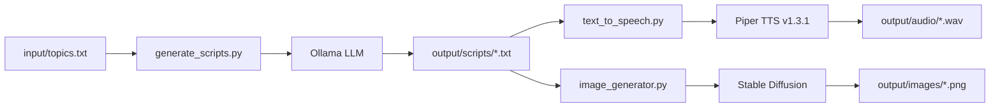

# 🎬 RESUMO EXECUTIVO - Pipeline de Geração de Conteúdo IA

**Data**: 09 Novembro 2025
**Status**: ✅ Pronto para execução com Piper TTS v1.3.1 (GPL) migrado

---

## ⚡ Início Rápido (Copie e Cole)

### Primeira Execução (Passo a Passo)

```bash
# 1. Ir para o diretório do projeto
cd /home/cloud/dev/homelab/supertest

# 2. Verificar/criar .env (se necessário)
[ -f .env ] && echo "✅ .env existe" || cp .env.example .env

# 3. Ajustar porta do TTS se necessário (crítico!)
sed -i 's/TTS_PORT=8090/TTS_PORT=5000/' .env

# 4. Ver comandos disponíveis
make help

# 5. MIGRAR PIPER TTS (OBRIGATÓRIO NA PRIMEIRA VEZ)
make migrate-piper
# Aguarde ~3 minutos (build + download da voz pt_BR)

# 6. Build do pipeline
make build

# 7. Executar pipeline básico (scripts + áudio)
make pipeline

# 8. Ver resultados
make monitor
```

---

## 📊 Estrutura do Projeto

```
supertest/
├── 🔧 Configuração
│   ├── .env                    # Variáveis de ambiente (AJUSTAR!)
│   ├── Makefile                # Comandos principais
│   └── Makefile.piper          # Comandos específicos do TTS
│
├── 🐳 Docker Compose
│   ├── docker-compose.tts.yml      # Piper TTS v1.3.1 (GPL)
│   ├── docker-compose.images.yml   # Stable Diffusion WebUI
│   ├── docker-compose.manager.yml  # Pipeline orchestrator
│   └── docker-compose.ollama.yml   # Ollama local (opcional)
│
├── 📜 Scripts Python
│   ├── generate_scripts.py     # Gera roteiros via Ollama
│   ├── text_to_speech.py       # Converte texto → áudio (Piper)
│   └── image_generator.py      # Gera imagens (Stable Diffusion)
│
├── 📂 Dados
│   ├── input/topics.txt        # Tópicos para gerar conteúdo
│   ├── output/scripts/         # Roteiros gerados (.txt)
│   ├── output/audio/           # Áudios gerados (.wav)
│   └── output/images/          # Imagens geradas (.png)
│
└── 📚 Documentação
    ├── GUIA_EXECUCAO.md        # 👈 GUIA COMPLETO (LEIA PRIMEIRO!)
    ├── README.md               # Visão geral do projeto
    ├── MIGRATION_PIPER.md      # Detalhes da migração TTS
    ├── README_PIPER.md         # Guia rápido Piper TTS
    └── TECH_ANALYSIS.md        # Análise técnica completa
```

---

## 🎯 Comandos Essenciais

### Setup Inicial (Execute UMA VEZ)

```bash
# Migrar Piper TTS (CRÍTICO - nova versão GPL)
make migrate-piper

# Build da imagem do pipeline
make build

# Testar conectividade
make test-network
```

### Execução Normal

```bash
# Pipeline básico (Scripts + Áudio)
make pipeline

# Pipeline completo (Scripts + Áudio + Imagens)
make full-pipeline

# Ver resultados
make monitor
```

### Troubleshooting

```bash
# Ver logs do TTS
make -f Makefile.piper logs

# Ver logs do pipeline
docker logs -f pipeline-manager

# Testar TTS isoladamente
make -f Makefile.piper test

# Limpar tudo e recomeçar
make clean
make -f Makefile.piper clean
```

---

## ⚠️ Pontos de Atenção

### 1. **Porta do TTS Mudou!**

- ❌ Antes: `TTS_PORT=8090` (rhasspy/piper)
- ✅ Agora: `TTS_PORT=5000` (OHF-Voice/piper1-gpl v1.3.1)

**Verificar**:
```bash
grep TTS_PORT .env
# Deve mostrar: TTS_PORT=5000
```

**Corrigir se necessário**:
```bash
sed -i 's/TTS_PORT=8090/TTS_PORT=5000/' .env
```

### 2. **Licença Mudou!**

- ❌ Antes: MIT (totalmente permissivo)
- ✅ Agora: GPL-3.0 (copyleft)
- ✅ **OK para homelab/uso pessoal**

### 3. **Primeira Execução Demora**

- Download da voz `pt_BR-faber-medium` (~80MB)
- Build da imagem Piper (~500MB)
- **Total**: ~3-5 minutos na primeira vez
- **Depois**: Instantâneo (cache)

### 4. **Ollama Deve Estar Rodando**

```bash
# Testar se Ollama está acessível
curl -s $OLLAMA_BASE_URL/api/tags | jq .

# Se não funcionar, verificar .env:
grep OLLAMA_BASE_URL .env
```

---

## 🔄 Fluxo de Execução



**Legenda**:
1. Você fornece tópicos em `input/topics.txt`
2. `generate_scripts.py` usa Ollama para criar roteiros
3. `text_to_speech.py` converte roteiros em áudio (Piper TTS)
4. `image_generator.py` gera imagens (Stable Diffusion) - opcional

---

## 📋 Checklist de Validação

### ✅ Antes de Executar

- [ ] Está no diretório correto: `/home/cloud/dev/homelab/supertest`
- [ ] Arquivo `.env` existe (ou criado com `cp .env.example .env`)
- [ ] `TTS_PORT=5000` (não 8090)
- [ ] Rede `proxy_net` existe (`docker network ls | grep proxy_net`)
- [ ] Ollama acessível (`curl -s $OLLAMA_BASE_URL/api/tags`)
- [ ] Pelo menos 1 tópico em `input/topics.txt`

### ✅ Após Migração Piper TTS

- [ ] Container `piper-tts` rodando (`docker ps | grep piper-tts`)
- [ ] Status "healthy" (`make -f Makefile.piper status`)
- [ ] Voz baixada (`docker exec piper-tts ls -lh /data/`)
- [ ] API responde (`curl http://localhost:5000/voices`)

### ✅ Após Pipeline

- [ ] Scripts gerados (`ls output/scripts/`)
- [ ] Áudios gerados (`ls output/audio/`)
- [ ] Arquivos `.wav` válidos

---

## 🆘 Problemas Comuns e Soluções

| Problema | Causa | Solução |
|----------|-------|---------|
| Container `piper-tts` não inicia | Porta incorreta | `sed -i 's/TTS_PORT=8090/TTS_PORT=5000/' .env` |
| "Voice not found" | Download falhou | `make -f Makefile.piper download-voice` |
| "TTS não acessível" | Container não rodando | `make tts` e aguardar 60s |
| "Ollama connection refused" | Ollama não rodando ou URL errada | Verificar `OLLAMA_BASE_URL` no `.env` |
| "Network proxy_net not found" | Rede não criada | `docker network create proxy_net` |
| Permission denied em output/ | Permissões incorretas | `sudo chown -R 1000:1000 output/` |

---

## 📚 Documentação Completa

| Documento | Descrição | Quando Usar |
|-----------|-----------|-------------|
| **GUIA_EXECUCAO.md** | 📘 Guia passo a passo detalhado | Primeira execução, troubleshooting |
| **README.md** | 📄 Visão geral do projeto | Entender arquitetura |
| **MIGRATION_PIPER.md** | 🔄 Detalhes técnicos da migração TTS | Problemas com Piper TTS |
| **README_PIPER.md** | 🎙️ Guia rápido Piper TTS | Usar TTS isoladamente |
| **TECH_ANALYSIS.md** | 🔬 Análise completa de tecnologias | Entender escolhas técnicas |

---

## 🚀 Comandos Mais Usados

```bash
# Ver ajuda
make help

# Primeira vez (migração completa)
make migrate-piper && make build && make pipeline

# Uso normal (após setup)
make pipeline

# Apenas TTS (testar isoladamente)
make -f Makefile.piper test

# Ver resultados
make monitor

# Limpar tudo
make clean && make -f Makefile.piper clean
```

---

## 📞 Comandos de Debug

```bash
# Logs em tempo real
docker logs -f piper-tts
docker logs -f pipeline-manager
docker logs -f stable-diffusion-api

# Status dos containers
docker ps -a | grep -E '(piper|pipeline|stable)'

# Inspecionar container
docker inspect piper-tts

# Shell no container
docker exec -it piper-tts bash

# Testar API manualmente
curl -X POST http://localhost:5000 \
  -H 'Content-Type: application/json' \
  -d '{"text": "teste"}' \
  -o /tmp/teste.wav
```

---

## ✅ Tudo Pronto!

**Próximo passo**: Leia `GUIA_EXECUCAO.md` para instruções detalhadas.

**Comando de início rápido**:
```bash
make migrate-piper && make pipeline
```

**Tempo estimado primeira execução**: ~5 minutos
**Tempo execuções seguintes**: ~1-2 minutos (dependendo dos tópicos)

---

**Última Atualização**: 09 Novembro 2025
**Versão**: Pipeline v1.0 + Piper TTS v1.3.1 (GPL)
**Status**: ✅ Pronto para produção
